# S4 Plus

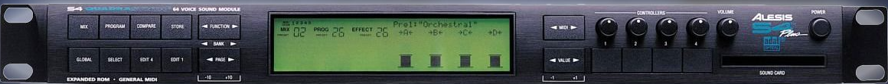

# Dismount

The S4 Plus is very simple to open. Just remove all the screws and the case will just separate in parts:

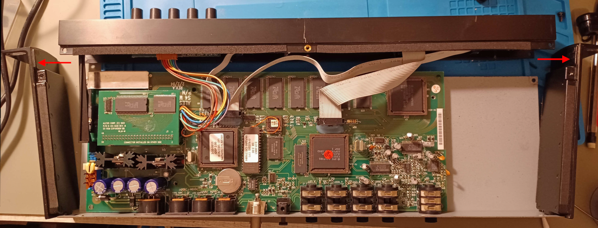

Next step, remove the little memory card on the left (This card add 8 MB of additional ROM samples for the S4 Plus, especially the "Stereo Grand Piano"):

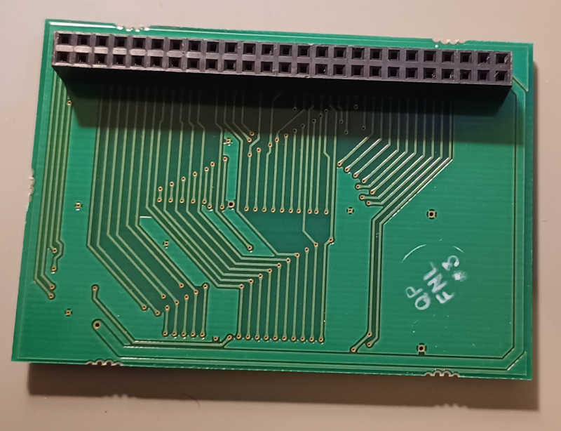

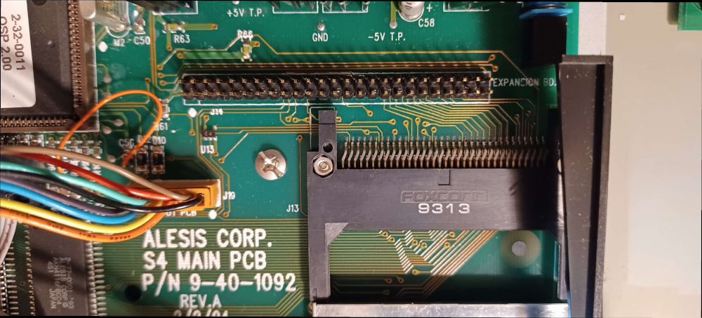

At this point you can remove the PCB screws.

# The issue

This unit does not always start properly, staying with a blank LCD screen.

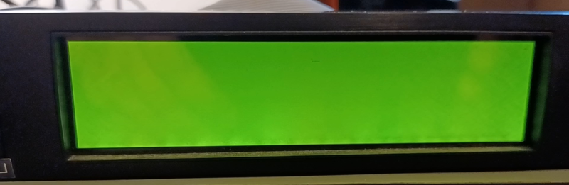

And suddenly it wakes up and everything works !

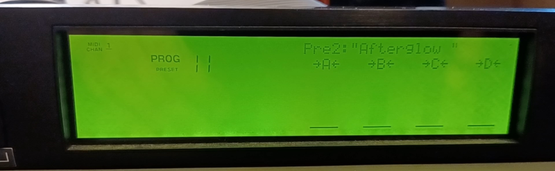

Sometimes it is the inverse, it returns to blank screen.

## Test points

First thing is to check the voltage on the 4 provided test points:

- +10 V: used for audio
- -10 V: used for audio
- +5V: used for IC and LCD
- -5V: used for IC and LCD

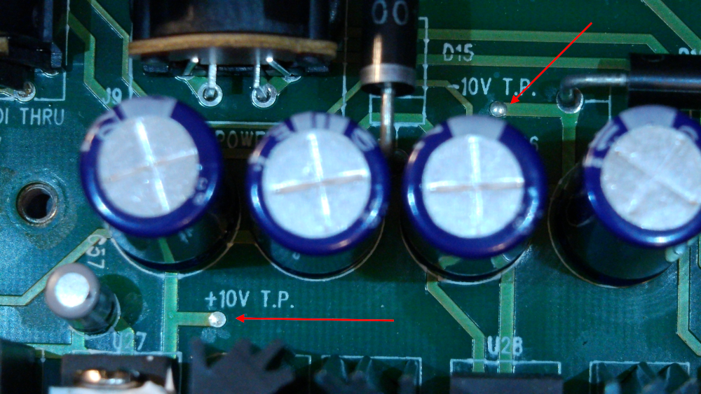

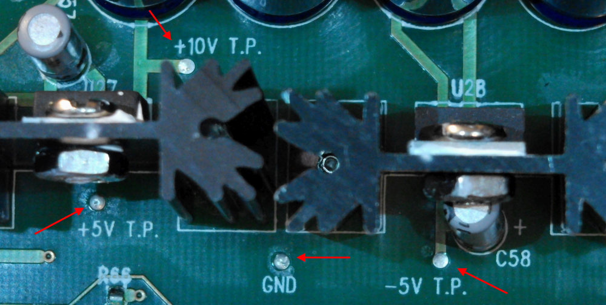

It turns out when the screen is blank:

-  -5V is fine
- +5V is gone !

Who is the culprit ?

## Filter capacitors

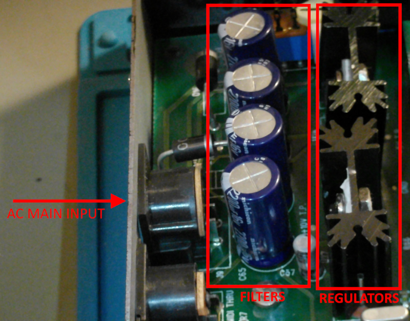

Let's check the 4 capacitors "in circuit" with the **ZOYI ZT-MD2** :

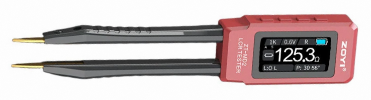

The 4 capacitors are marked **2200µF 16V** so we will perform a scan with 0.6V instead of 0.1V because they are big.

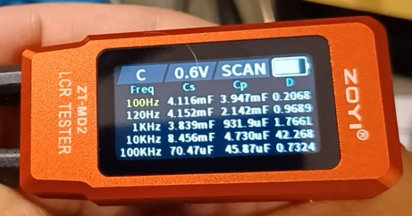

| Measure                   | Meaning                                                      | Usage                                                        |
| ------------------------- | ------------------------------------------------------------ | ------------------------------------------------------------ |
| Cs, Series Capacitance    | Calculates capacitance by modeling the component as an ideal capacitor in series with an **Equivalent Series Resistance** (ESR) | Low-impedance components, large electrolytic capacitors (>10µF, and low-frequency measurements (100 Hz - 1 kHz). |
| Cp , Parallel Capacitance | Calculates capacitance by modeling the component as an ideal capacitor in parallel with a leakage resistance | High-impedance components, small ceramic/film capacitors (<1µF) and high-frequency measurements (>10kHz) |
| D                         | Dissipation factor, indirectly measure the ESR               | High ESR indicate a faulty capacitor. With age, they act as a resistance and don't perform properly. |

Since we measure "in circuit", high frequencies can be ignored because they leak into nearby components. We just read the row **100hz**.

- We read Cs = 4.116mF = **4116µF** which is 2 times 2200µF: this indicate two capacitors are in parallel.
- D is **0.2068** which is perfectly ok at 100Hz for for large electrolytic power filter capacitors in-circuit.

I've got pretty much the same readings on all 4 capacitors, so... **they are all fine**.

## Regulators

We have two regulators:

| Component                                                    | Description                                     |
| ------------------------------------------------------------ | ----------------------------------------------- |
| 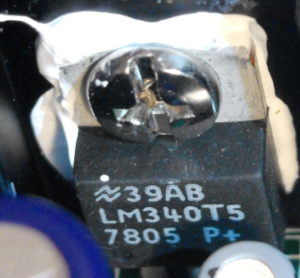 | The **LM340T5 / 7805** is the regulator for +5V |
| 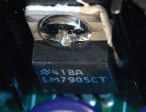 | The **LM7905CT** is the regulator for -5V       |

Good chances are the LM7905CT is fine but the LM340T5 need a reflow to work properly again:

- At cold temperatures, either a **cracked solder joint** at the regulator's pins breaks electrical continuity, or the **internal silicon/starter junction** of the LM340T5 fails to initiate regulation.
- As the component warms up (either via operation or thermal testing), thermal expansion restores contact/conduction, restoring the +5V rail and allowing the digital section (including the ROM Expansion board) to boot.

## LM340T5 reflow 

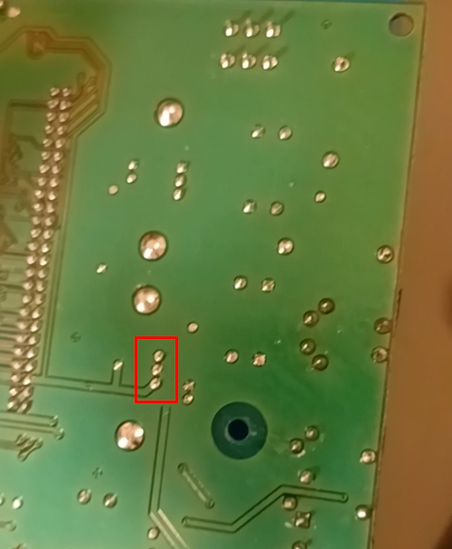

- Clean and prep solder joints using desoldering braid
- Soldering iron around 350°C – 380°C
- Rosin Flux: Adding extra flux speeds up the wicking action.
- Isopropyl Alcohol (IPA) & Brush: For post-cleaning
- Finally put Fresh Solder

# Power circuit

## PSU

The S4 Plus use a AC/AC power supply, not a AC/DC. Model **AC09-22DE** (E for Europe).

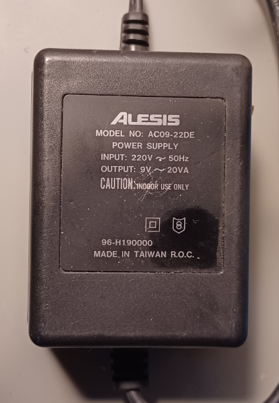

It uses a DIN connector:

| Rear connector                                               | PSU Plug                                                     |
| ------------------------------------------------------------ | ------------------------------------------------------------ |
| 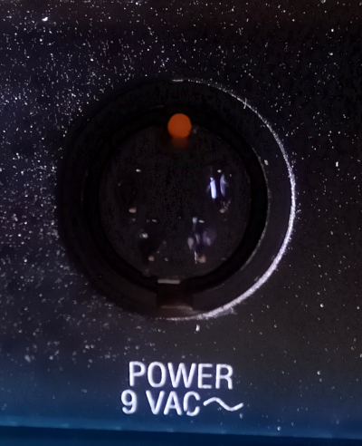 | 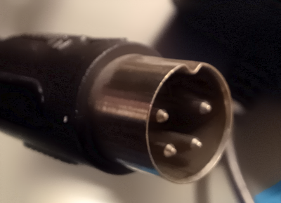 |

The lines are doubled. Facing the rear connection you have:

- On the left, the **ground**
- On the right, the **AC**

## Diodes

The PSU brings the 9V AC signal (9V RMS, in fact it is bigger peak to peak) which pass into a **dual Half-wave rectifier** in the synth. This is the very first circuit behind the connector.

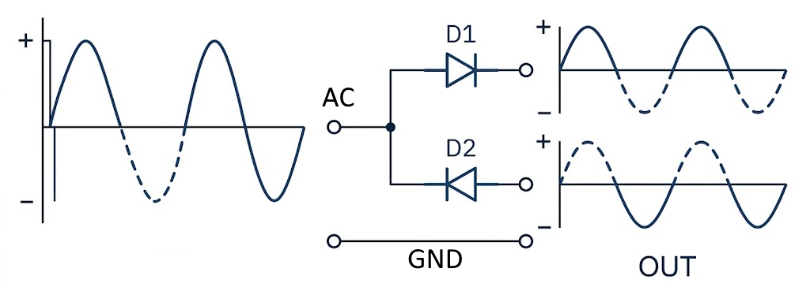

The two diodes are located here:

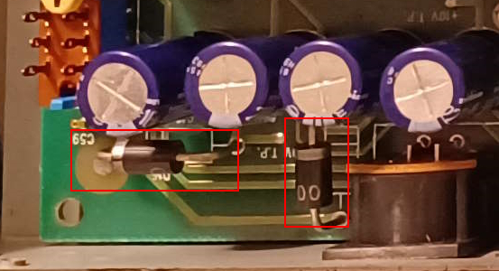

## Capacitors

The four capacitors (2200uF) work in pair, mounted in parallel.

- Two to rectify the positive signal of the first diode
- Two to rectify the negative signal of the second diode

Something like this:

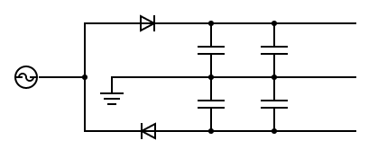

Probing before the diode with 2 probes give you the input AC signal which is 26.7V peak to peak:

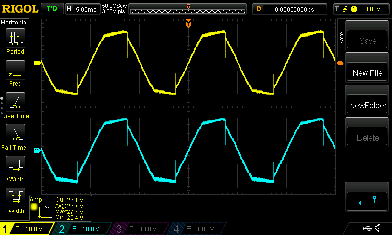

Probing after the diodes give you the two rectified signals: **+12V** and **-12V**

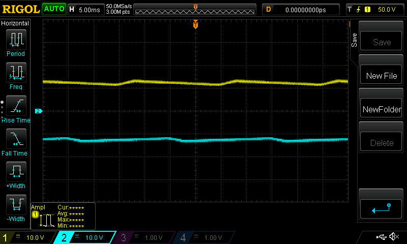

The next step is to generate, +-10V and +-5V from this. It seems only the +- 5V are regulated.

