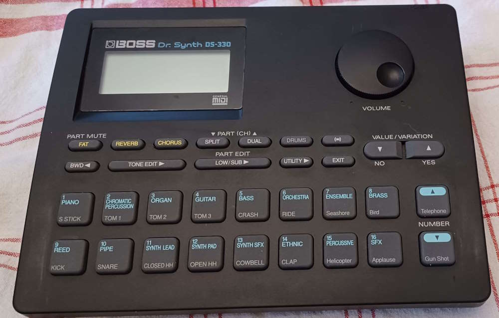
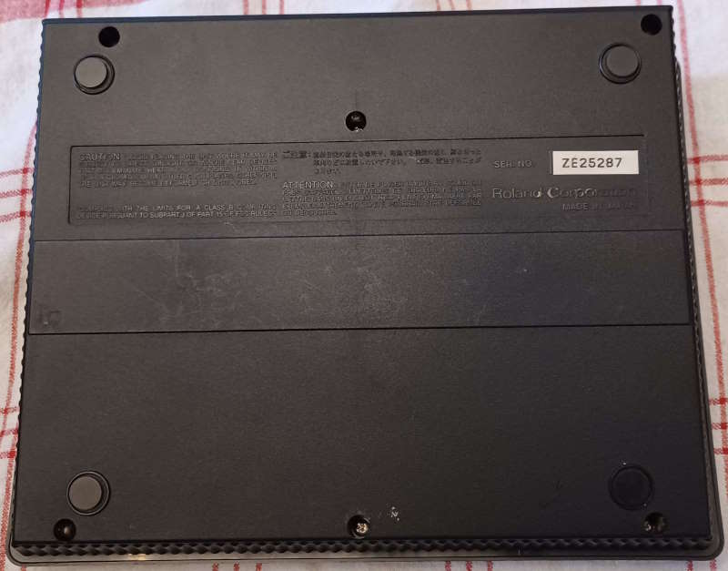
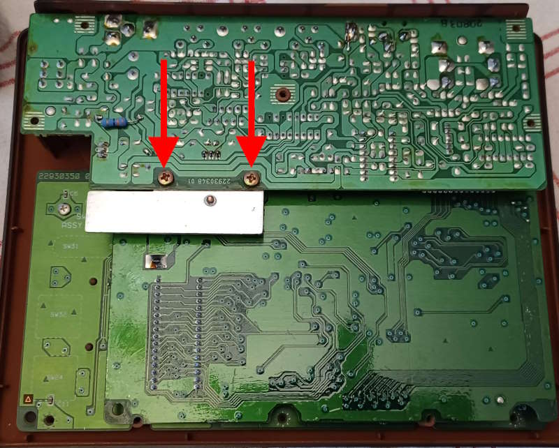
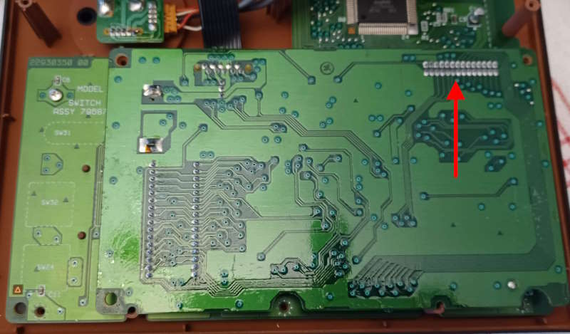
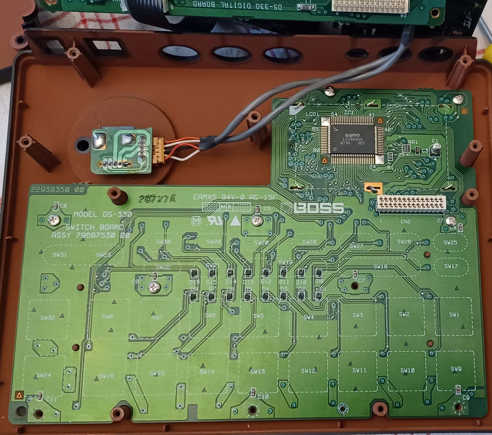
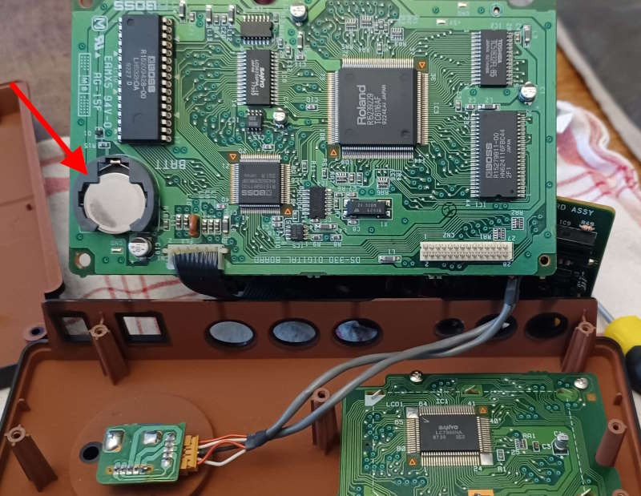
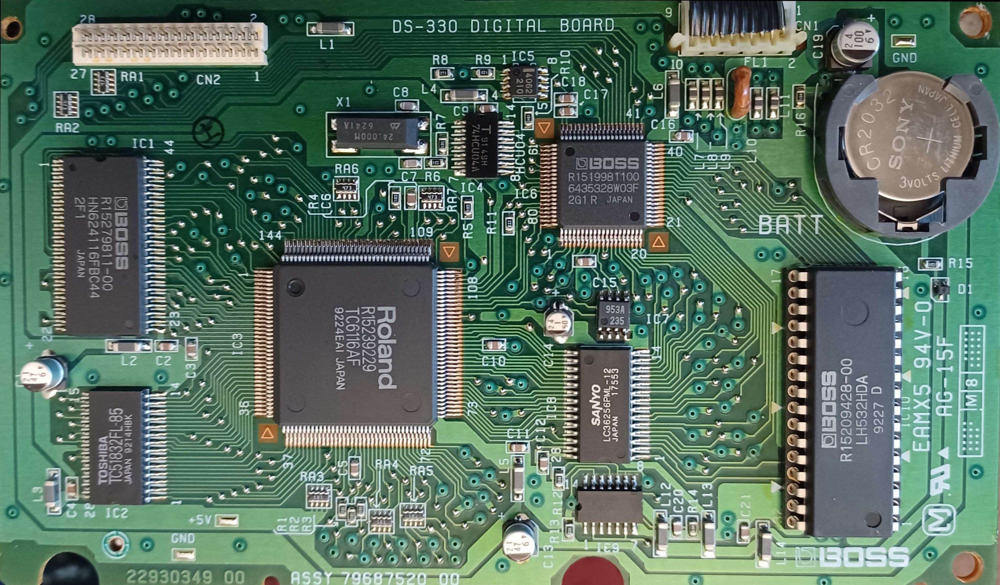

# BOSS DS-330

# Overview

The Boss DS-330 is in fact a Roland SC-33. Manufactured in 1993. 

- The unit is a **Sound Canvas**, a very popular series (see wiki page [here](https://en.wikipedia.org/wiki/Roland_Sound_Canvas)) from Roland.
- It is compatible with **General MIDI** (GM) standard and also **Roland GS** standard.
- 16 parts, 28 voices, 226 Tones, 8 Drum sets
- 16 bits samples at 32Khz

# How to change the battery

## Step 1

Unscrew from the back

## Step 2

Unscrew the top card

## Step 3

Now you need separate gently the front card from the one which is below. They are connected by a 14*2 pins white connector

## Step 4: Switch Board

This reveal the Switch Board 

## Step 5: Battery

Finally, the battery is here, on the top board

## Step 6: Main board

Replace the battery with a regular CR2032

