# Kurzweil K2600R

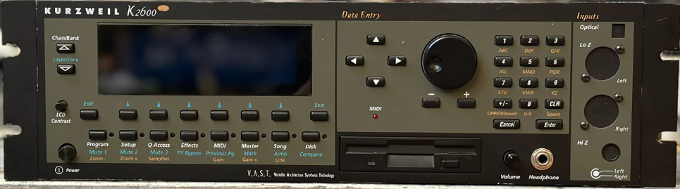

# Chipset

| 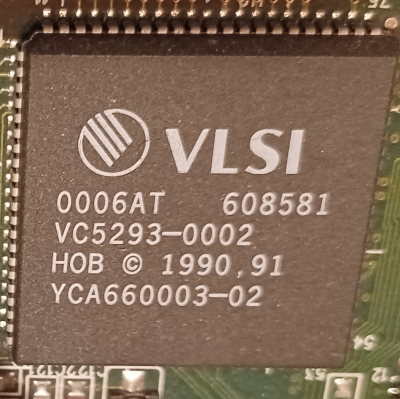 | 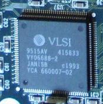 |
| ------------------------------------------------------------ | ------------------------------------------------------------ |


The K2600R is based on **VLSI** chips which are ASICs (Application-specific integrated circuits). 

- "HOB" means **Hobbes**: it is the chip responsible for I/O (ROM/SCSI/...)
- "JANIS" is the name of the operating system: The OS was **Calvin** in K2000. It is **Janis** in K2600.

# Floppy

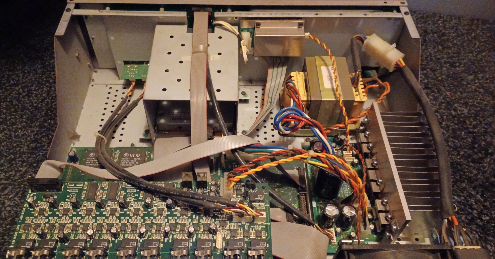

Replacing the floppy drive is very easy. You just have to extract the metallic case.

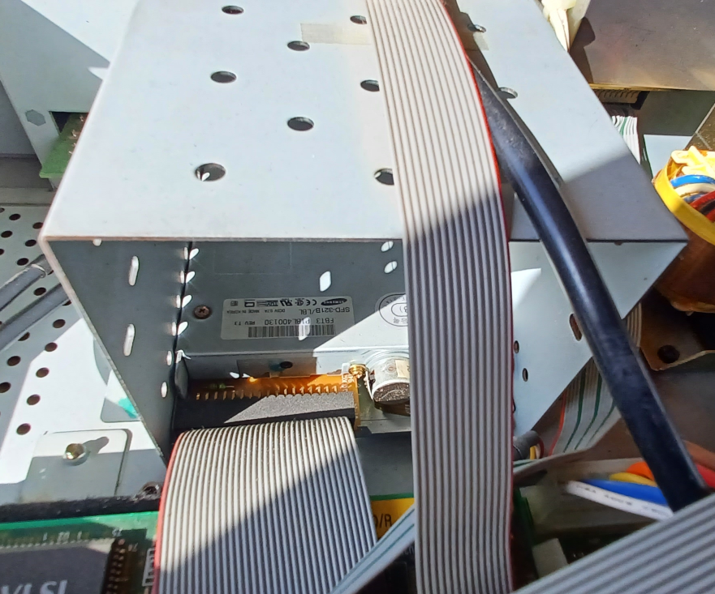

The drive is a well known **Samsung SFD-321B**. Manual can be found at [floppy.cafe](https://floppy.cafe/) [here](https://floppy.cafe/resources/SAMSUNG-SFD321B-070103.pdf).

## IDC Cables

The Kurzweil is full of IDC cables. It's a little bit of the mess. Pay attention to the metallic clamp on the connectors:

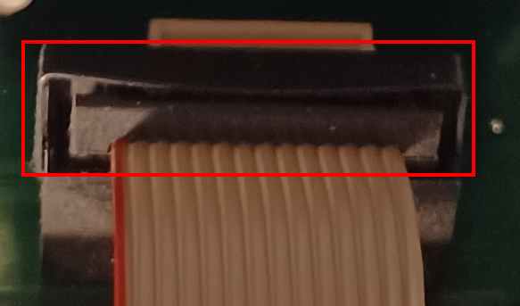

It must be removed **before** pulling out the cable.

First disconnect the **power cable** on the top:

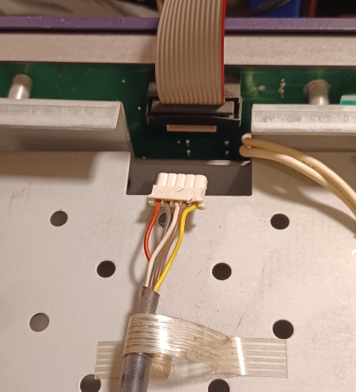

Then disconnect the IDC cable from the motherboard, not from the front panel. ⚠️ Don't take the risk of loosing the clamp inside the front panel !

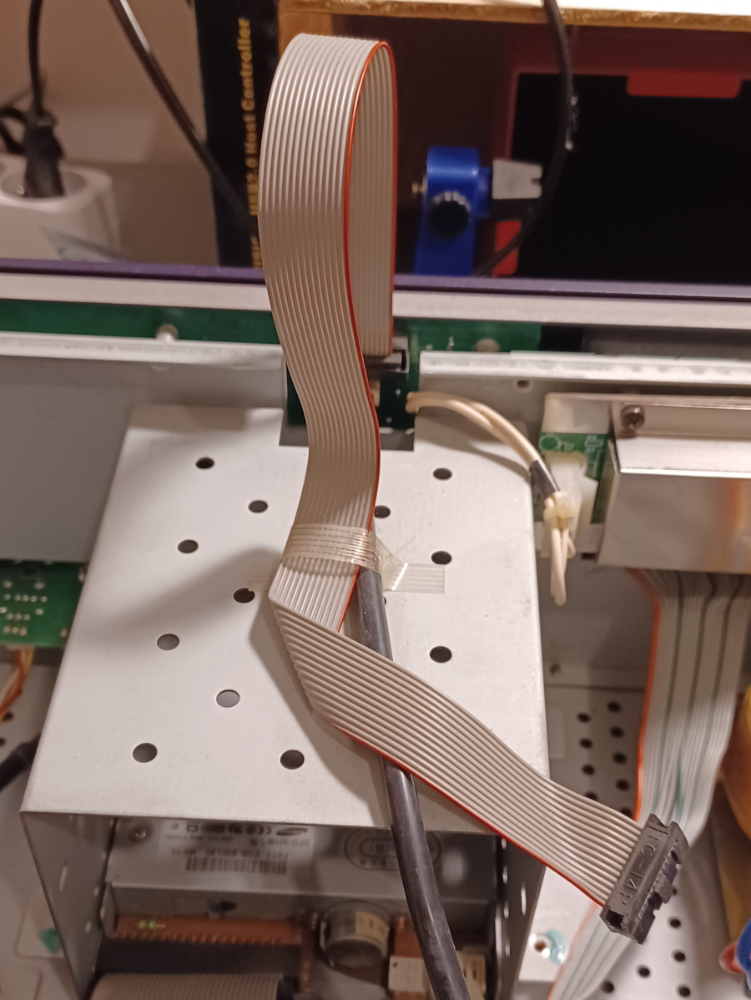

Now unscrew the case and remove it from the unit:

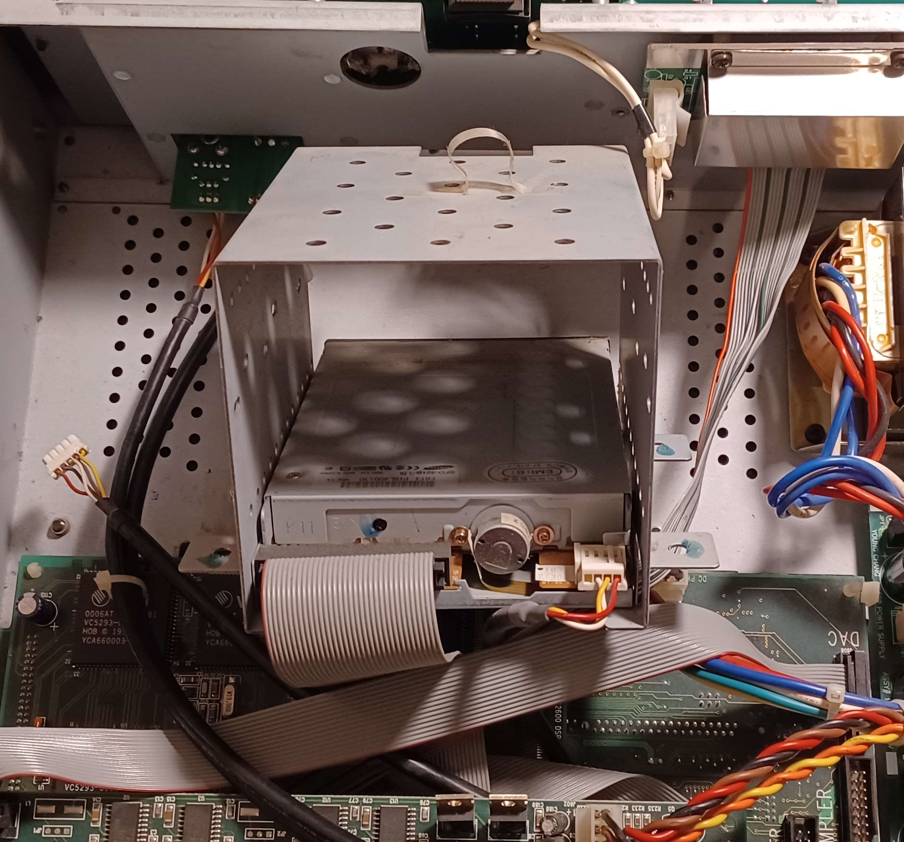

Disconnect the Floppy

## Pins

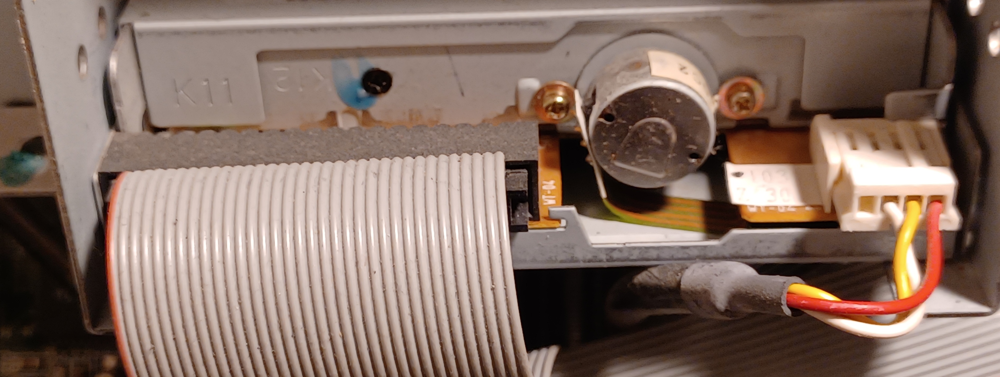

First important thing to notice: **the red polarity stripe** is on the opposite of the Berg Connector. ⚠️This is not like a PC !

A Quick look to the manual confirm the pin numbers:

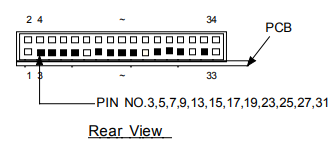

It is important to understand this:

- A Floppy connector is made of 34 wires
- 17 of them goes to the ground GND (Odd numbers).
- Some drives like the Samsung can decide to not connect all the GND pins
- Some drives like the Samsung can **change the meaning of some pins** with some soldering or jumpers

The pin 34 can be configured in two ways:

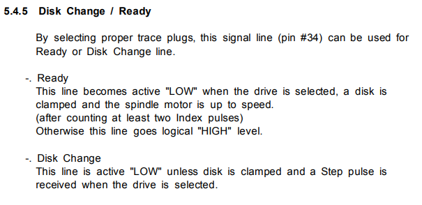

⚠️If you plan to replace the floppy by a Gotek you need to know how pin 34 is wired

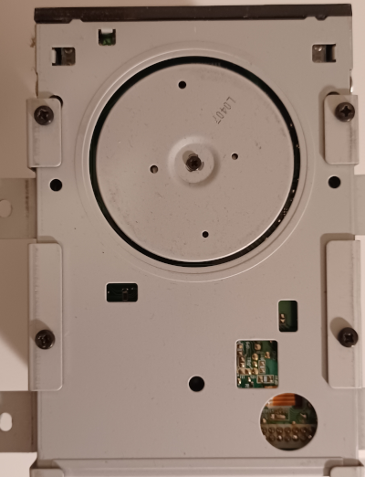

You can remove the floppy from the case from the bottom. 4 screws has to be removed here.

## PCB

The floppy PCB reveal the configuration of the pins. But you need to know what to look for...

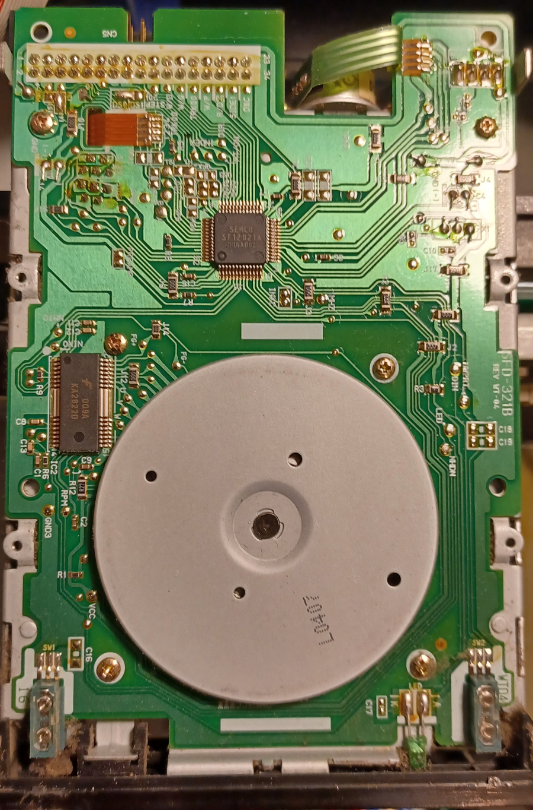

## DS0

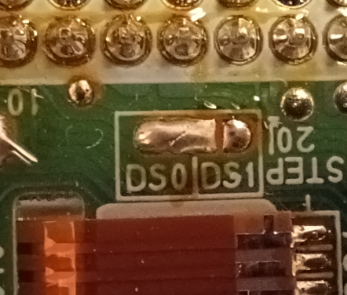

The Kurzweil use floppy drives in **DS0 mode**. This mean they are configured to be "A:". This is the exact opposite of PC.

This soldering prove that.

## Disc Change

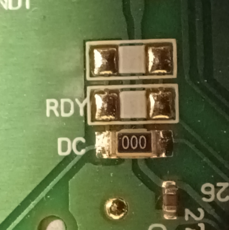

The pin 34 is configured in **DC mode**. This mean Kurzweil uses "**Disc Change**" instead of "Disc Ready".

On this photo the "000" is a 0 Ohm resistance, proving the DC mode is enabled. That's not the case on the RDY.

# Gotek

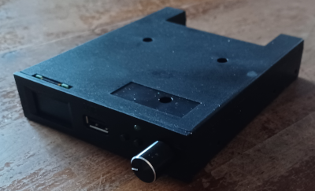

**Gotek** is a generic floppy emulator which can be used with different firmwares. I highly recommend to use an **AT32F435** with [FlashFloppy](https://github.com/keirf/flashfloppy). [HxC](https://hxc2001.com/docs/gotek-floppy-emulator-hxc-firmware/pages/usage-modes.html) is another possible firmware.

## Pins

⚠️Given what we know on the IDC Cable, make sur you connect the red polarity stripe to the pin 1 of the gotek (P1 on this photo).

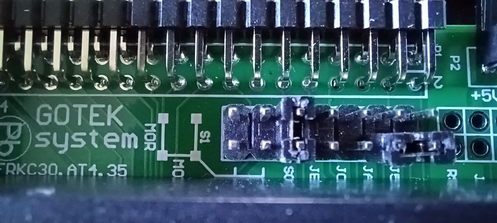

Here how to configure the Gotek **AT32F435** for the K2600R.

- 👉**S0** is **enabled** with a jumper. The Gotek act as a drive "A:"
- **S1** is disabled. Kurzweil does not handle drive "B:"
- 👉**MO** is **disabled**: use "motor on" signal on pin Drive Select instead of pin 16. The Samsung does not work like this. This is for very old drives.
- 👉**JC** is **disabled**: because the pin 34 is in "Disc change", not "Disc Ready".
- **J5** and **JA** are not used. We use them to store jumpers (see photo). (JA was used for Amiga)
- **JB** is disabled: it is used for HxC

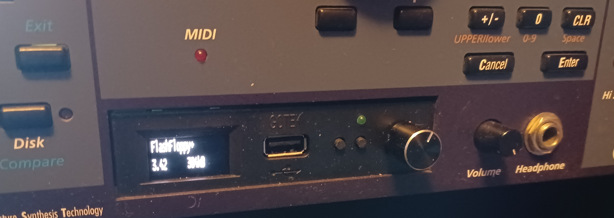

⚠️When you put the Gotek in the unit, make sure you didn't invert the orientation of the case because the holes won't match.

## Config

```
## FLASHFLOPPY CONFIG FOR KURZWEIL K2600R (SAMSUNG SFD-321B REPLACEMENT)

# Match the PC-standard interface of the K2600R
interface = ibmpc

# Match the Samsung SFD-321B Pin 34 behavior (Disk Change)
# This ensures the Kurzweil knows when you've swapped virtual disks
chgr-signal = chg

# Optimization
host = pc-dos

# Navigation & Display settings
nav-loop = yes
display-type = auto
display-scroll-rate = 200
# LCD orientation
display-type = oled-rotate

# Optional: Audible head stepping sound
step-volume = 10

# Disable auto select image when rotating the Gotek knob
autoselect-delay = 0
```

⚠️I had to use `oled-rotate` because my LCD screen was upside down.

## Software

The Gotek will receive an USB stick full of floppy images in IMG format.

Use [AIM Toolkit](https://sourceforge.net/projects/aim-toolkit/) to mount images on a R/W virtual drive:

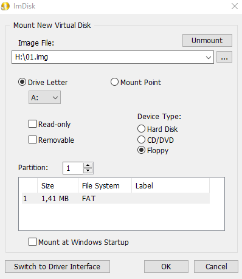

Kurzweil use FAT format so you can format the IMG from your PC directly.

You can download empty IMG images from FlashFloppy site [here](https://github.com/keirf/flashfloppy-images), and more precisely [here](https://github.com/keirf/flashfloppy-images/tree/master/Unformatted/IMG).
