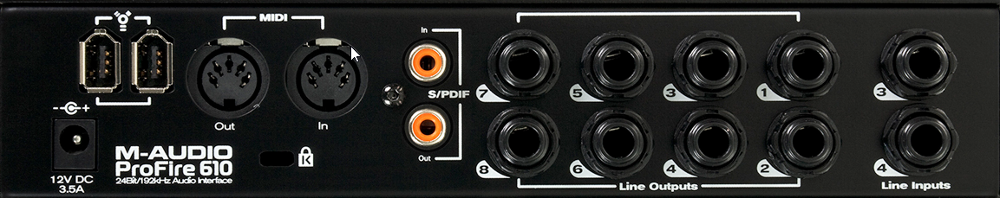
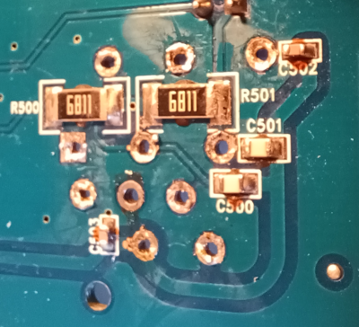
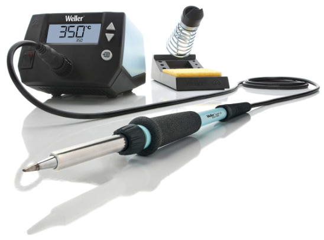

# M-Audio Profire 610

# Overview

This Firewire sound card was released around 2009 by M-Audio. It is a miracle that the driver is still working today in Windows 11.

- Six-input, ten-output audio configuration
- Up to 24-bit/192kHz operation
- Two high-quality mic/instrument preamps featuring OctaneTM technology, LED meters, and phantom power
- Two front-panel XLR/TS Combo jacks accepting mic or instrument level inputs
- Two rear-panel 1/4” TRS balanced line inputs
- Eight rear-panel 1/4” TRS balanced line outputs
- Two independent 1/4” headphone outputs with volume control knobs for each output
- S/PDIF In/Out
- MIDI In/Out
- Powerful onboard DSP providing five near-zero latency 16x2 monitor mixers
- User-assignable Master Volume control
- Functions as a standalone two-channel mic preamp and A/D – D/A converter

# Faulty Connector

Nevertheless I had a well known issue with one "dual  XLR/Jack" connector: the connector break and the JACK stay stuck in it. 

So my goal here, is to replace it.

Surprisingly the XLR connector is a **10 pins** connector: **Amphenol ACJC10HL BULK** (more info [here](https://www.mouser.fr/ProductDetail/Amphenol-Audio/ACJC10HL-BULK?qs=c9RBuMmXG6LBou%252BjSrSpwA%3D%3D))

This connector is designed to receive stereo JACK (TRS) in the center but the Profire 610 accept only Mono Jack (TR). What's the point ?!

So I decided to replace it with a **5 pins** connector: **Amphenol ACJC5H BULK** (more info [here](https://www.mouser.fr/ProductDetail/523-ACJC5HBULK))

But to reach the connector, I had to dismount the entire unit.

# Dismount

## Top

## Front

First unscrew the front panel

Then pull all the buttons:

Beware, you can damage them !

You should get this:

Now you have to remove the washers:

Now you can remove the metallic part:

## Back

Same thing, remove all the washers on all connectors:

## Inside

You have to unscrew the two PCB. Note that they are connected to the main board with a pin connector, so be gentle:

After removing the screw on the 2 PCB, you will have to remove those:

They are not easy to remove because they are hidden below:

## Main board

# Desolder

## Pins

Here is the beast: the 10 pins XLR connector: how to know where to desolder ??

Given the [datasheet](https://www.amphenol-sine.com/pdf/datasheet/ACJC10HL%20BULK.pdf) I was able to name each pins:

XLR pins:

Jack pins:

Beware, the layout is component side, not solder side !

Surprisingly there is a different pin naming in the layout: GN is GS, SN is SS, RN is RS, TN is TS

👉 "S" stands for **switch contacts**: When the jack is unplugged, R is connected to RN, T to TN, and S to SN. This put the **pins to the ground** when the JACK is unplugged **to be silent**.

## Oops

The desoldering was a nightmare, but I finally be able to remove the connector:

I used a screwdriver to remove the connector: bad idea !!, here the component side...

# Soldering

## Oops

How to oxide your brand new Weller solder tip in 25 minutes when you don't know what you are doing ?

I bought the famous soldering station Weller WE 1010 for this job:

Here on top my brand new tip after the job, and a unused one at the bottom....ooops.

🤣Here is how to fail miserably:

- First, you think unsolder without flux will be fine
- Then, you don't know that unsolder needs also **tin on the tip** !
- You never used your brand new WD1010 to solder, so the tip has not a single trace of tin on it
- You start at 250°C and nothing works. **The tin on the board does not melt**
- You try with [CHEMTRONICS desoldering braid](https://www.chemtronics.com/desoldering-braid-wick): mitigate result
- You change the WE1010 timer to never cool down: another great idea
- So you try at 300°C, still without tin on the tip: same. nothing works
- So you try at 400°C, 450°C and at this point your tip is completely oxidized. Bravo !
- Final touch: use a metal screwdriver to remove the connector in the worst way possible

The right way to desolder:

- Immediately put tin on the tip
- Keep the WE1010 timer at 2min
- Use the desoldering braid in the first place **with flux**
- Use also use a desoldering pump
- Use a thin plastic spatula to eject the connector

## Final result

Its time to put the brand new connector into the board:

The **ACJC5H** pins are compatible with the **ACJC10HL**. I don't have any switch contacts but it works fine.

