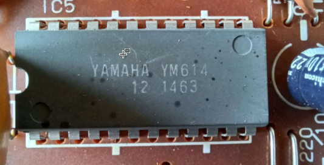

# Yamaha C-55N Organ

# Overview

## PASS

This organ is based on the **Pulse Analog Synthesis System** (PASS) which mix analog and digital circuitry:

- The digital circuitry is dedicated to deliver steady raw oscillators which goes never out of tune like their analog friends
- The analog circuitry is dedicated to the rest: Filters, VCA, Vibrato and so on.

PASS made its first apparition in the mythical [GX-1](https://en.wikipedia.org/wiki/Yamaha_GX-1) in 1977 (see [this wonderful](https://www.youtube.com/watch?v=WLSditiJVpc) video on youtube)

- Documentation can be found on-line in the Internet archive [here](https://archive.org/details/Yamaha_PAS_System_Electone_Service_Guide_Analysis_1) and [here](https://archive.org/details/Yamaha_PAS_System_Electone_Service_Guide_Analysis_2).
- Part of the analog circuitry is similar to the famous CS-80 (used by Vangelis in Blade runner soundtrack) nevertheless, oscillators are digitals so it is not the same thing.

PASS is based on a dual-stage synthesis system:

- The **synthesizing method** is used alone for flute sounds using sine waves
- The **filter method** is used for oboe, clarinet and strings
- All wave forms are digitally produced but those two systems are analog

Here the outline of a PASS Electone:

### Additive synthesis

The first synthesis used in PASS is similar to the additive synthesis.

### Subtractive synthesis

The second synthesis used in PASS is similar to the subtractive synthesis. The goal here is to be able to produce **complicated overtones** which can't be synthesized with additive synthesis.

## Electone organs

Yamaha had a fairly logical model numbering system for this series: A, B, C, D, E, etc. 

- As technology improved during this era, the "5" series was released. So, instead of a D-80 or E-70, you now had the D-85 and E-75. Very similar to the previous series, but with more "computerized" features such as a rhythm sequencer and digital tempo readout, and better "ergonomical" features such as the **Ensemble tabs**. New voice section names were added such as "**Custom Voices**" and "**Special Presets**", but they were identical in sound to the previous series.
- Then to really confuse everybody, the "N" series came out for the A, B and C Electones. So a B-55 or C-55 were now a B-55N or C55N. These models brought features such as a new improved auto-arpeggio and Symphonic Chorus/Celeste to name a few.
- During this period, Yamaha also released some models that were identical to each other, but with different model numbers. Does anyone really know what the difference between the D-85 and 415 are? Other than the decorative front legs on the D-85, they are identical. Same goes for the E-75 and 6000, and the C-55N and 315.
- Electone was on the absolute cutting edge of analog and digital technology for its time; allowing you to **blend sounds via tabs** before all sound were selected with buttons in 1983's F-series

# Service Manual

It is very important to get the service manual before attempting to dismount the organ. They explain important things that you should be aware of.

It can be found  [here](https://elektrotanya.com/yamaha_electone_c-55n.pdf/download.html).

# Dismount

The C-55N of my family was fantastic. I still have very good memories of it so **I decided to bring him back to my home studio 30 years later.** 

The only issue was to get the beast into my car: Due to the heavy weight and the pedal keyboard, I had to completely dismount it ! This is something you normally don't want to do.

## Dust

The device was in very good shape but was full of dust in some areas. 

## Overview

The device is designed to be open: you can lift-up the front panel and the two keyboards like this:

The metallic part on the right is the power supply. 

## Leslie

The Leslie is the heaviest thing in the unit because **it contains a motor**. It provides a **tremolo effect**. See the wiki page [here](https://en.wikipedia.org/wiki/Leslie_speaker).

As usual with this organ, everything is easily reachable: the Leslie box can be opened like a door.

On the bottom left you can see two connectors which seems to be used to connect **an external tremolo unit** to the organ.

Unfortunately this Leslie was dead long before. I don't plan to repair it.

## Cables

You have to prepare yourself to deal with a LOT of cables. Here is the front panel which is like an octopus !

**Ribbon cables** are used to transport notes data to the main board

## Fuses

Fuses are located in the power supply board below the keyboards

## Metallic plates

This kind of vintage electronic is sensible to static electricity, so metallic plates was used to catch anything "in the air". Of course they have to be grounded to do their job.

Here is another one on the left: it's a special paper connected to the ground  (The power supply is on the right).

This "grounded paper" protect the main board.

## Main board

Deep inside the device, below the grounded paper, we found the main board. It is called **Digital Master** (DM) in the service manual.

- On the left the ribbon cable bring note data
- The giant cable coming from the front panel end-up here

This board contain the digital oscillators and other goodies:

### YM601

This is the "Key Assigner", also called KAS which read data from the ribbon cable.

### YM645

This is certainly the "**ROM VI**" of the service manual but they talk about a YM635

### YM605

This is the "Tone Generator II", called **DTG II** in the service manual.

### YM614

This is the  "Tone Generator III", called **DTG III** in the service manual.

### YM607

This is the "Tone Generator IV", called **DTG IV** in the service manual.

## Ground

Metallic plates have to be grounded.

Same thing for the metallic support of the power supply:

Same thing with the pedal keyboard:

## Spring Reverb

The spring reverb can be found in the back, behind the pedal keyboard. Surprisingly it is not protected.

## Pedal keyboard

The pedal keyboard was not easy to dismount, I had to reverse the organ on its side:

## Organ case

Here is the empty case with the speaker (back side). On the bottom right remains the **spring reverb**.

The front side

## Smell

In order to get rid of the smell I used **pure vinegar** (not on the circuitry of course) and **long sun baths**.

## Re-mounting

Re-mounting the organ was not so hard because I took tons of photos. Unfortunately a screw falled into the power supply so I had to mount a second time the whole thing. **The organ works perfectly and its inside is now without dust.**

# Buttons Cleanup

## WD-40

The best way to clean buttons is to use thing thing

## The goal

The buttons in the middle does not work very well. Unfortunately it is impossible to take them off from the front panel, **you have to extract the entire module from the organ to be able to clean their base**.

We need to extract this module:

## Step 1: Bottom plate

**First thing to do**: spot the screw on the sides, they need to be removed in order to flip the entire panel up.

Electone organs are VERY simple to open. Just read the service manual.

## Step 1: The Mistake

As you can see there is a big metallic plate covering the circuitry (It is used to prevent static electricity and **must be connected to the ground**) on both sides. The first mistake is to remove completely the screws because at some point the plate will fall onto the cables:

Instead you should unscrew **partially** then extract the plate with both hands: there is a hole dedicated to this operation !

Note one of the screws needs to be completely removed because it is connected to the ground:

## Step 2: Top plate

Remove the plate on the other side. In the same way you have to disconnect the ground cable from it.

## Step 3: Sliders buttons

The two plates are gone, now you need to remove the slider buttons:

## Step 4: The module

Now you can unscrew the module (on both sides).

The module is now extracted. Disconnect the cables. Take a photo to be able to reconnect them later !

## Step 5: The cleanup

You can now put the module in a safe place where you can apply the WD-40. **Protect your hand and your eyes**, this thing is not a joke.

You should apply the WD-40 vertically in order to avoid any leak on the circuit:

**Click on the buttons** many times to let the liquid penetrate inside the mechanism. Don't hesitate to cleanup the sliders too !

It is also a good time to **cleanup the colored plastic** with a little bit of alcohol on a cotton swab:

## Step 6: Test

Reconnect everything and test the module like this (it should be safe enough even without the metallic plates).

The left buttons are working perfectly but still need a little bit more of WD-40 on the right ones. So I disconnected the module and cleaned it up again.

## Conclusion

The buttons are working perfectly now. The entire operation was simple after-all. 

- Just don't do the same mistake than me regarding the metallic plates: you don't have to unscrew them completely.
- Also **don't forget to reconnect the plates to the ground !** They are pointless if you don't.

# Vibrato 

## Simple hack

In the chapter "Buttons Cleanup" I found on the board some variable resistors that you can modify with a simple screwdriver

This one in particular is fantastic, you can make the vibrato much slower than usual.

