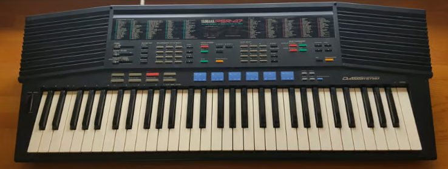
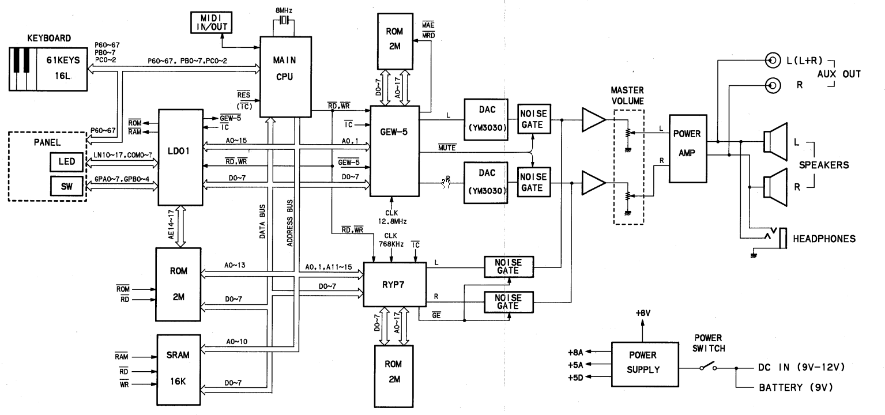
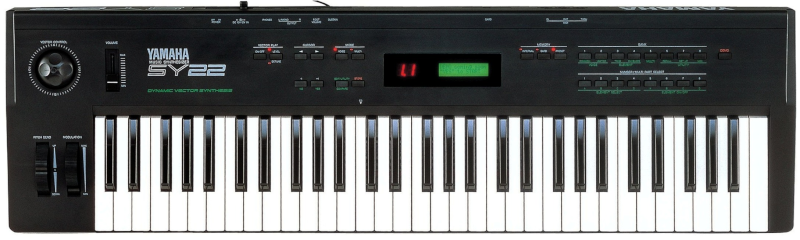

# Yamaha PSR-47

# Overview

The PSR-47 is an entry level keyboard. It was produced in 1989.

- **PSR** stand for "Porta Sound Regular" in the sense they have regular size. It was also called Portatone.
- Whereas the **PSS** series was "Porta Sound Small" with small keys

## Portasound

- More infos on Portatone [here](https://pianoandsynth.com/yamaha-psr-portatone-models-1984-2022/).
- More infos on Portasound [here](https://pianoandsynth.com/yamaha-pss-portasound-models-1980-1997/) and [here](https://en.wikipedia.org/wiki/Yamaha_Portasound).

## Features

- 61 keys
- 8 bit samples
- 100 DASSystem Voices
- Dual Voice
- 100 PCM Rhythm Styles
- Solo Styleplay
- 2-Track Music Programmer
- Custom Drummer
- Drum Pads
- Keyboard Split
- Auto Bass Chord
- MIDI
- 8-Note Polyphonic
- Stereo Sound System
- Demonstration Song ([here on Youtube](https://www.youtube.com/watch?v=bOYqpjdb0hE))
- Pitch Bend Wheel

## DASS

The PSR-47 is based on the **Dual Architectural Synthesis System** (DASS) tone generator which combined **FM** and **AWM** tone generators to create realistic sounds.

AWM stands for **Advanced Wave Memory**. It is equivalent of the well known [Pulse Code Modulation](https://en.wikipedia.org/wiki/Pulse-code_modulation) (PCM) except the storage of waveforms is different.

# Circuitry

The core of the device is based on two chip: the **GEW-5** and the **RYP7**. You can found a lot of informations about Yamaha chips [here](https://www.dtech.lv/techarticles_yamaha_chips.html).

## GEW-5

The PSR-47 use the very same chip than the SY series which is the **GEW-5**. 

The GEW-5 is an **AWM & FM Tone Generator**. There is only one in the PSR-47 whereas the SY22 had 4 of them.

## RYP7

This chip is a **Drum rompler** that uses external 8bit parallel rom. It supports both 8bit linear and 12bit packed waveform data formats. Supports stereo panning, and up to 63 waveforms in 512kbytes or less. Has an internal stereo DAC and 4 channel slow ADC.

# Service Manual

You can download it from [here](https://elektrotanya.com/yamaha_psr-47.zip/download.html#dl)
