# TQ-5

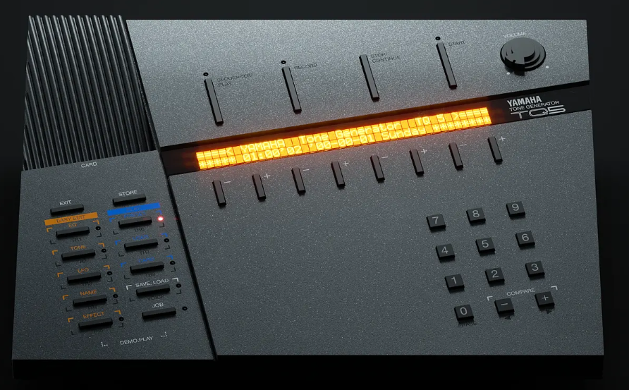

# Overview

The Yamaha TQ-5 is the desktop version of the YS-200. 

**Synthesis Engine:** 4-Operator FM Synthesis (OPZ / YM2414 chip family, similar to the TX81Z and DX11)

**Polyphony:** 8 voices

**Multitimbral / Parts:** 8 parts

**Algorithms:** 8 algorithms

**Waveforms:** 8 standard waveforms (Sine, All positive sine, Direct sine, etc.) plus user-selectable operator waves

**Sequencer:** 8-track sequencer with real-time and step recording, and built-in pattern/song memory

**Effects:** Built-in digital effects processor (Reverb, Delay, Distortion, Echo)

**Presets:** 100 preset voices, 100 internal user voices, 100 multi-setup memories (Performances)

**Storage / Expansion:** Yamaha MCD32 or MCD64 Memory Card slot, MIDI Data Dump support

**Display:** Backlit LCD screen

**Controllers / Interface:** Unique front-panel layout with directional buttons and a data entry slider designed for desktop operation

**Connections:**

- MIDI In, Out, Thru
- Stereo Audio Output (L/Mono, R)
- Headphone jack
- Sustain pedal input

# PCB

**This unit is a real pain to open** due to 4 "grounded" screws on top right and top left. Be patient. don't rush.

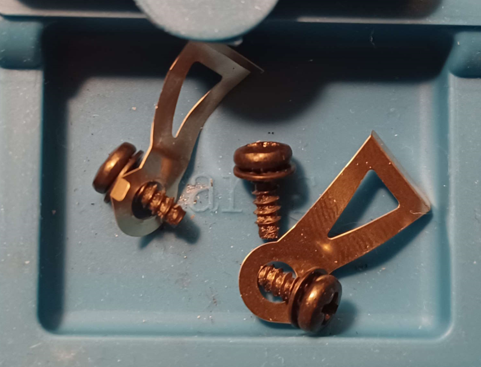

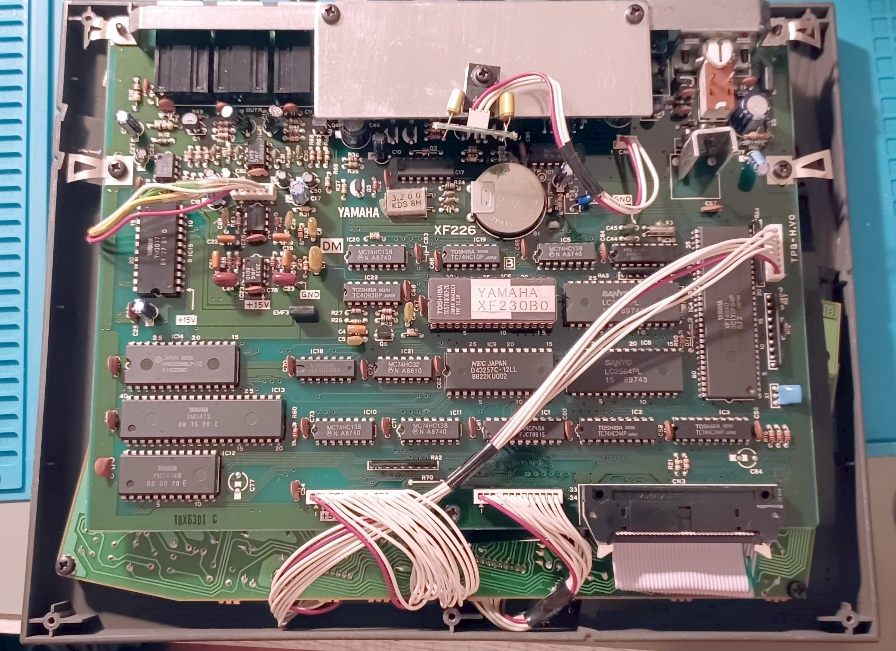

## ROM

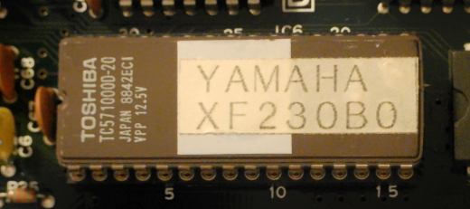

The firmware is located in **IC6** which is a Toshiba EPROM: TC571000D-20. This chip contains the sounds.

## SRAM

The user presets are stored in **IC7** and contains 8KBytes of memory.

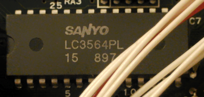

## Glue Logic

The **XF148A0** is a custom ASIC/Gate array. It acts as a hardware bridge that handles data routing and communication between the main microprocessor, the front-panel interface (buttons and display), and the internal system buses, significantly reducing the need for discrete logic components on the motherboard.

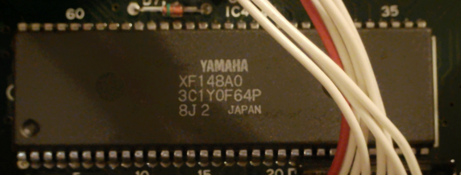

## FM  chip

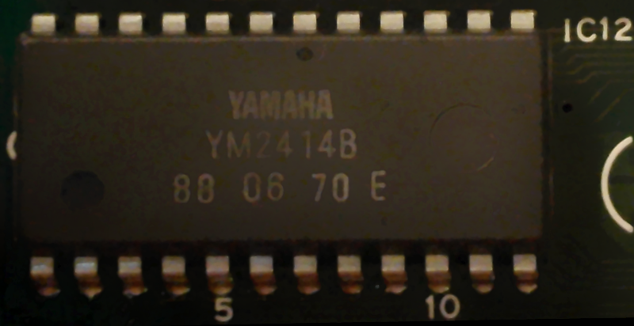

**IC12** is the legendary **4-operator FM synthesis sound chip YM2414B** (known as the **OPZ**), which is the core sound engine of the TQ-5 and many other Yamaha synths.

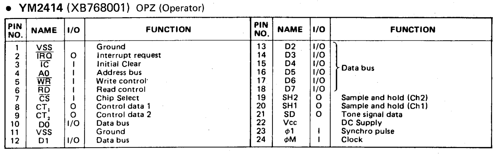

The digital signal (floating point samples) is serialized through 2 bits: **SH1** and **SH2**

## LDSP

This chip is responsible for **Delay** and **Reverb**.

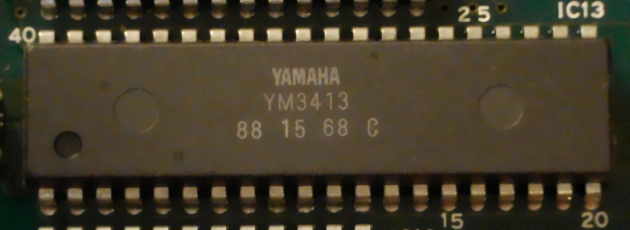

**IC13** is the **YM3413** which receive the digital waveforms from the **YM2414B** and send back the signal to the final DAC.

**NOTE**: the audio signal is **serialized** through 2 bits. This chip receive it in **SI0** and **SI1** and output it through **SO0** and **SO1**.

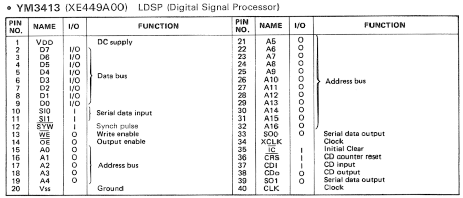

It can be found in the SY77, TG100 or PSR-510

## Weird DAC

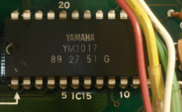

**IC15** is the Digital to Analog converter of the TQ5 often called DAL: **Yamaha YM3017**. It can be found also in the Yamaha YS200 or V50 service manual.

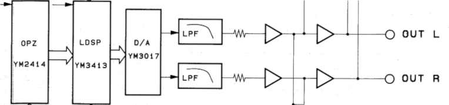

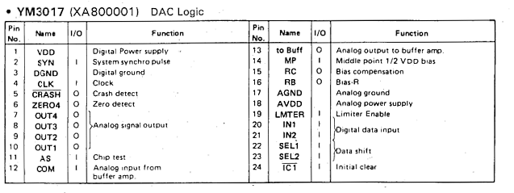

Some info can be found in **Yamaha HS Series Organ IC Data book**, I was not able to found the official datasheet of this model (YM3015 and YM3020 can be found).

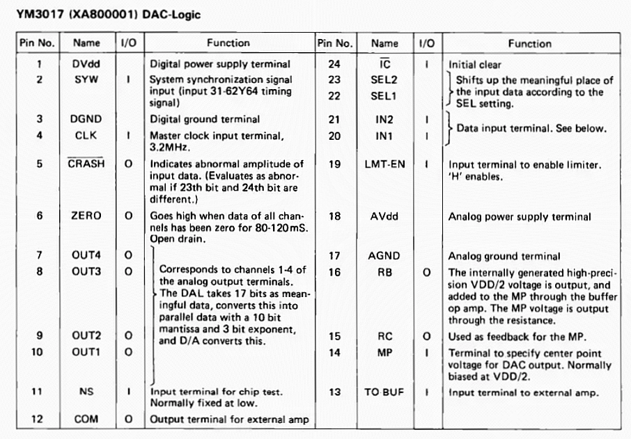

Apparently it acts as the **YM3015** or **YM3020**, it is a 2 bit serial input receiving **4 floating point numbers**.

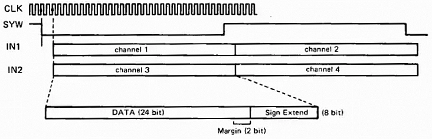

Therefore, the chip provides **4 analog outputs** whereas **YM3015** and **YM3020** provide only 2 analog outputs.

This is very weird because the TQ-5 and YS-200 use only 1 stereo output.

# Battery replacement

## Dismount

After removing the screw on left and right...

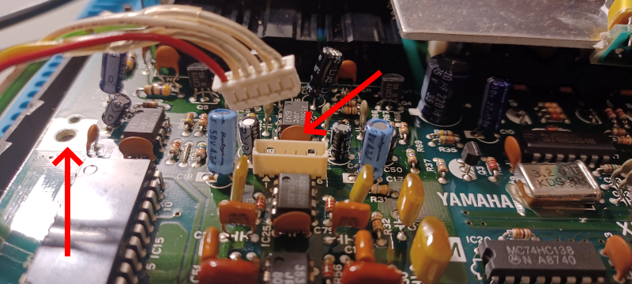

I had only ONE ribbon to unplug, and the whole PCB open like a book:

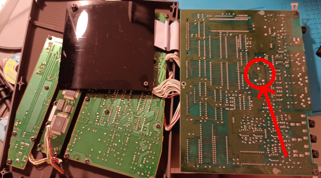

The red circle indicate where the battery need to be unsoldered

## The original

Same story than **TX-81Z**: the battery need to be unsoldered to be changed. It is a **CR2450**:

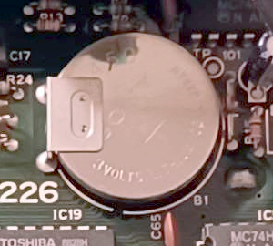

You have to remove the first PCB to be able to properly unsolder the battery holder from the back:

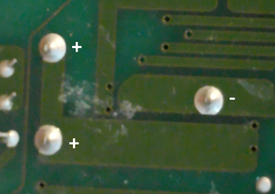

Be ready to struggle !

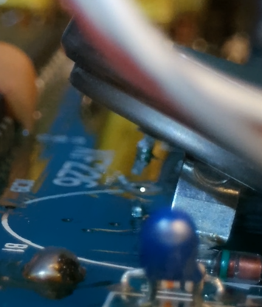

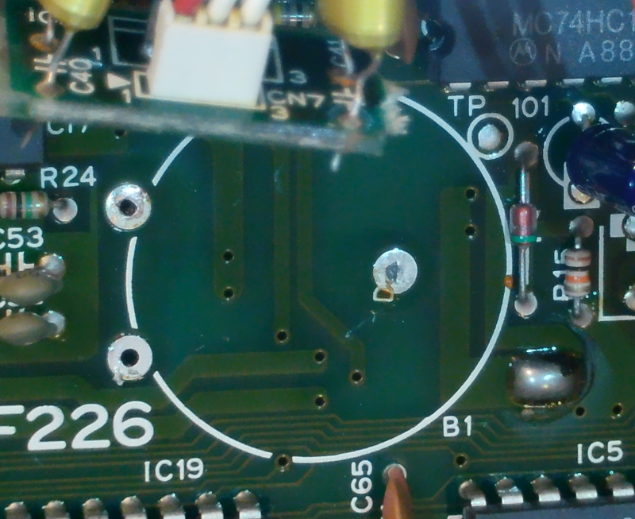

## Replacement

You can buy a bunch of CR2450 holders made by "sourcing map" on amazon [here](https://www.amazon.fr/dp/B07JLY8S4N).

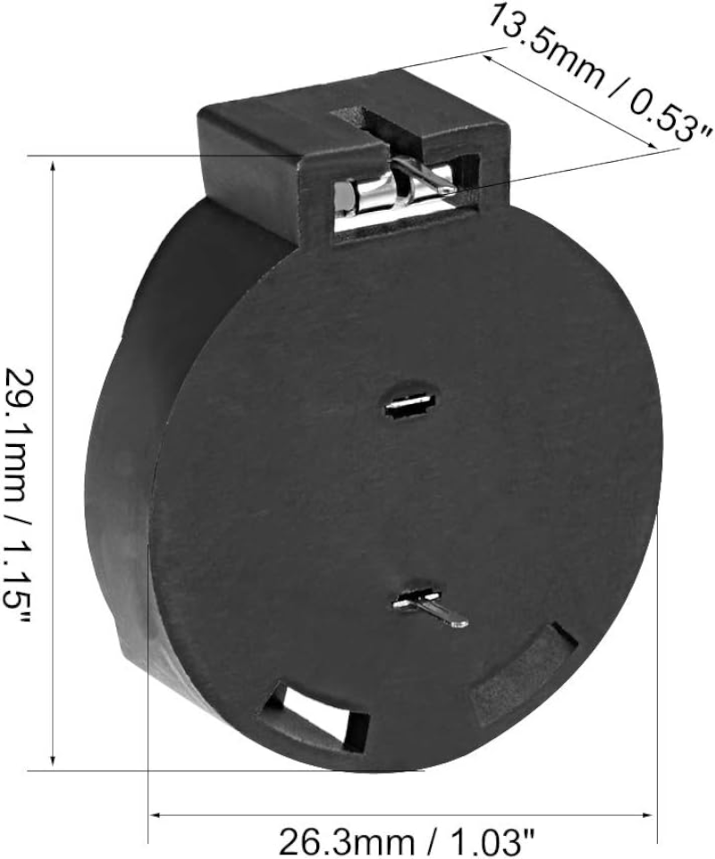

Aligning the pin on the hole is not very difficult

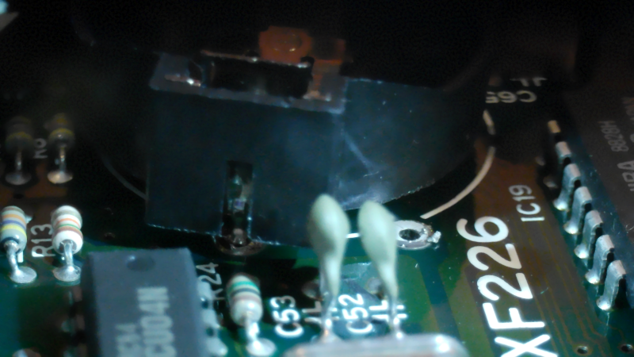

Make sure you don't touch the components around, you should have just enough space.

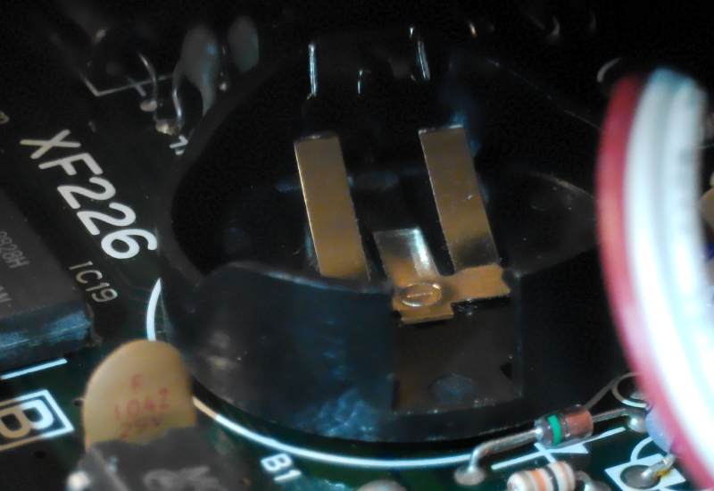

You will solder from the back of the PCB. It is not very easy to do because we have only two hands ! 

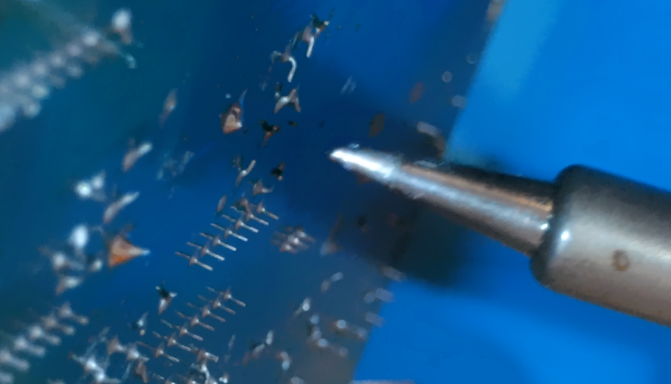

**NOTE**: we use only two holes in the PCB, the third one is left "as is"

The battery holder should be now very close to the PCB.

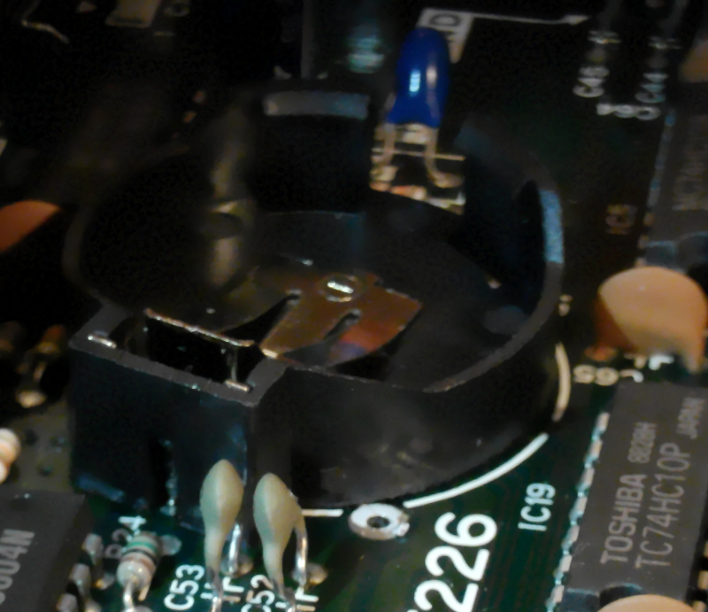

## Final result

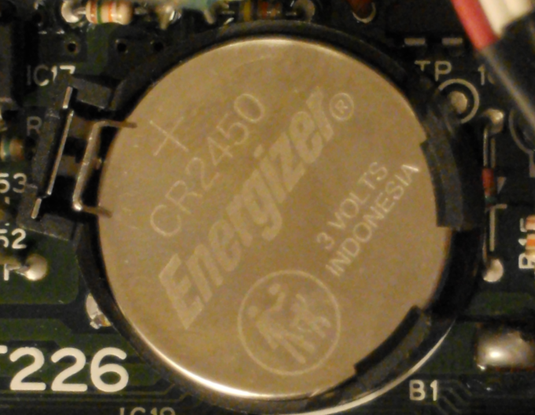

Note how the diode on the right is very close, so don't try to squeeze the battery holder on the PCB, you may damage it !
